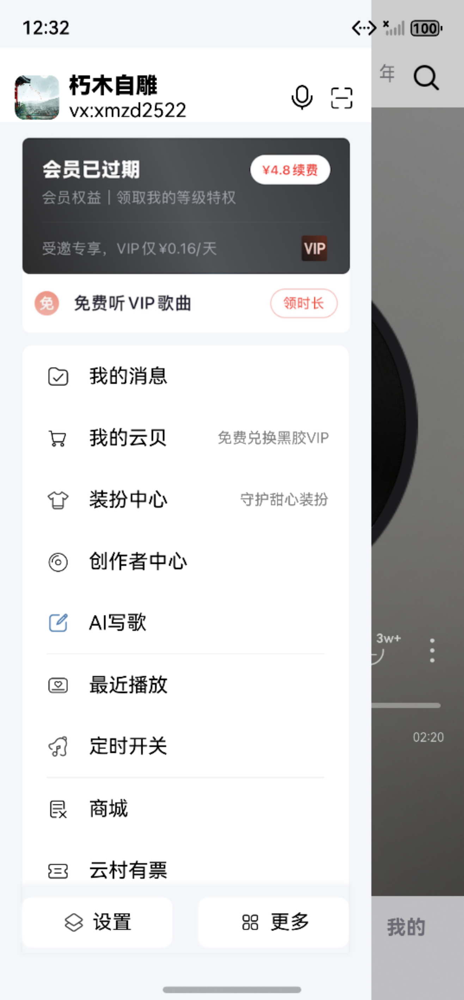
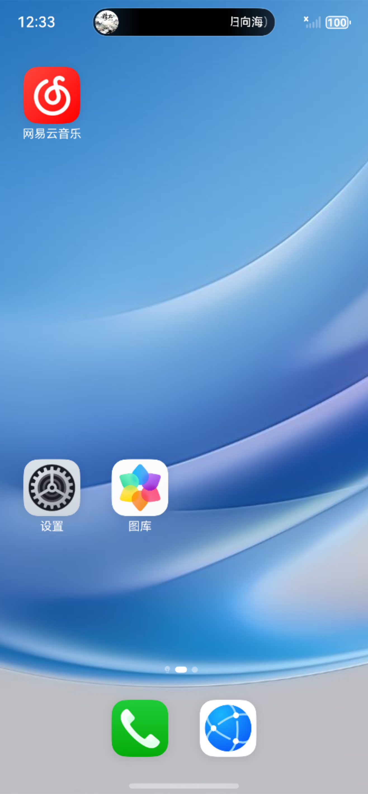

# 网易云音乐 HarmonyOS 版

## 🎬 演示视频

<div align="center">
  <video src="./images/video.mov" controls width="600"></video>
</div>

> 如果视频无法播放，请下载到本地查看：`images/video.mov`

## 📸 应用截图

<div align="center">
  
  
  
  
</div>

<div align="center">
  
  
  
  
</div>

## 📖 项目简介

这是一个基于 HarmonyOS 鸿蒙系统开发的网易云音乐客户端，参考了网易云音乐 iOS 版本的视觉设计和交互体验。项目采用 ArkTS 语言开发，是个人在探索学习鸿蒙应用开发过程中的一次尝试。


## 🛠️ 技术栈

- **开发语言**: ArkTS
- **开发框架**: HarmonyOS SDK
- **网络请求**: @ohos/axios (v2.2.6)
- **AI 模型**: DeepSeek API（用于 AI 歌词创作功能）

## 📋 环境要求

- HarmonyOS SDK API 9 或以上
- DevEco Studio
- Node.js (用于依赖管理)

## 🚀 快速开始

### 1. 克隆项目

```bash
git clone https://github.com/your-username/NetEasyMusic.git
cd NetEasyMusic
```

### 2. 安装依赖

在项目根目录下执行以下命令安装依赖：

```bash
ohpm install
```

> **注意**: 如果 `ohpm` 命令不可用，请确保已正确安装 DevEco Studio 并配置好环境变量。

### 3. 配置 DeepSeek API Key（可选）

如果需要体验 AI 歌词创作功能，请配置 DeepSeek API Key：

1. 前往 [DeepSeek 官网](https://www.deepseek.com/) 注册并获取 API Key
2. 打开 `entry/src/main/ets/utils/EnvConfig.ets` 文件
3. 修改 `DEEP_SEEK_API_KEY` 的值：

```typescript
export const DEEP_SEEK_API_KEY: string = 'your-deepseek-api-key-here';
```

### 4. 调试模式配置（可选）

如果遇到网络接口异常，可以切换到本地 Mock 数据模式：

打开 `entry/src/main/ets/utils/EnvConfig.ets` 文件，修改：

```typescript
export const IS_DEBUG: boolean = true;
```

### 5. 运行项目

1. 使用 DevEco Studio 打开项目
2. 连接 HarmonyOS 设备或启动模拟器
3. 点击运行按钮 ▶️ 或按 `Shift + F10`

## 📁 项目结构

```
NetEasyMusic/
├── entry/                          # 主模块
│   └── src/
│       └── main/
│           ├── ets/
│           │   ├── entryability/   # 应用入口
│           │   ├── pages/          # 页面
│           │   ├── models/         # 数据模型
│           │   ├── viewModels/     # 视图模型
│           │   ├── views/          # 视图组件
│           │   ├── services/       # 业务服务
│           │   ├── network/        # 网络请求
│           │   ├── utils/          # 工具类
│           │   └── features/       # 特性模块
│           └── resources/          # 资源文件
├── images/                         # 项目截图与视频
├── oh_modules/                     # 依赖模块
└── oh-package.json5                # 依赖配置
```

## 🔌 API 说明

### 网易云音乐 API

- **Base URL**: `https://music.163.com/api`
- **版本**: 公开 API
- **超时设置**: 30 秒

> **免责声明**: 本项目仅用于个人学习交流，API 接口来自网易云音乐公开接口，请勿用于任何商业用途。

### DeepSeek API

- AI 歌词创作功能基于 DeepSeek 大语言模型实现
- 使用前需自行申请 API Key
- 配置位置: `entry/src/main/ets/utils/EnvConfig.ets`

## 🎬 演示说明

项目包含演示视频和截图，详见 `images/` 目录

## 🤝 贡献

如发现问题或有改进建议，欢迎提交 Issue 和 Pull Request，不胜感激！

## 📄 开源协议

本项目仅供学习交流使用，请勿用于任何商业目的。

## ⚠️ 免责声明

- 本项目为个人学习项目，与网易云音乐官方无任何关联
- 项目中使用的 API 接口仅供学习研究使用
- 请支持正版音乐，尊重知识产权

## 👨‍💻 作者

Finn Guo

## 📮 反馈与建议

如有问题或建议，欢迎通过 GitHub Issues 交流探讨。

---

⭐ 如果这个项目对你有所帮助或启发，欢迎 Star 支持！
